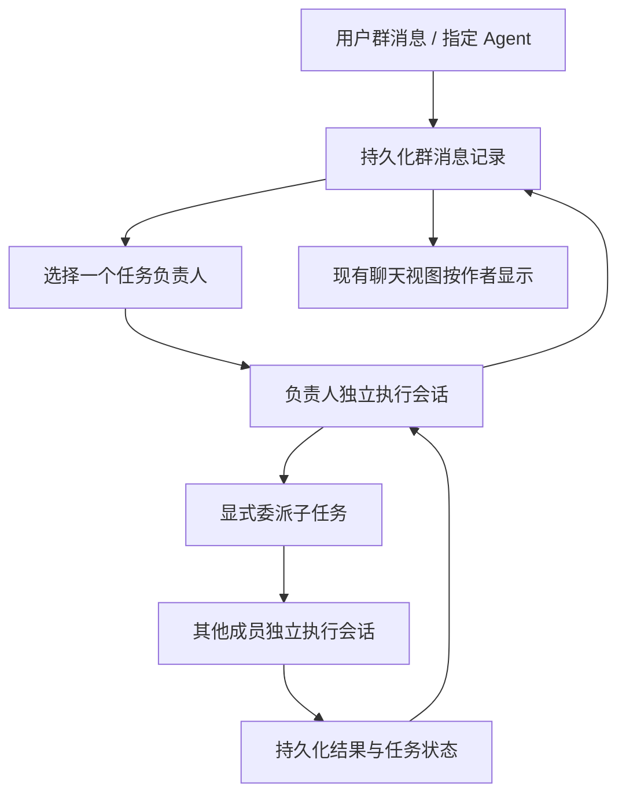

# 多 Agent 协同与群聊机制调研

调研日期：2026-10-05。范围来自 [feasibility.md](feasibility.md)、[nightly OpenBot 调研](nightly-openbot-assessment.md)、[OpenAgentCore 调研](openagentcore-assessment.md) 与 [参考项目对齐记录](product/11-parity.md)。联网核对官方仓库，并沿建群、消息路由、执行上下文、结果回传和持久化链路阅读固定提交源码。以下是实现层面的证据，未进行上游完整服务或真实模型验收。

## 结论与项目地图

**两个 OpenBot 和 botiverse Raft 都有真正的产品内群聊。CopilotKit OpenBot 偏“多 Bot 按顺序回答、@ 接力”；nightly OpenBot 偏“群内任务有一个负责人，显式委派并回收结果”。** Raft 偏“常驻成员各自判断是否发言，用认领锁防重复”。其他项目分别是专家会话、后台任务、专家路由或原生子 Agent，不能只凭名字里的 Multi-Agent 判断存在拉群功能。

| 项目 / 本次快照 | 多 Agent 如何协同 | 拉群机制与边界 |
| --- | --- | --- |
| [nightly-labs OpenBot · 38101be](https://github.com/nightly-labs/openbot/tree/38101be3be673b74d10841d42c1b1cd82cee8856) | 单负责人 + 子任务/转交 + 共享历史 + 独立执行 thread | **有**：用户选 Agent 建频道、管理成员和 lead；见下文及 [频道工具][N5] |
| [CopilotKit OpenBot · cb5dc32](https://github.com/CopilotKit/OpenBot/tree/cb5dc32a44517622c6db4e527e61d3abb389b43c) | 共享 transcript、顺序发言、@ peer；另有异步 message_bot | **有**：用户选 2–20 个 Bot，另可按邮箱加真人；见下文群路由源码 |
| [OpenDots · c2569bb](https://github.com/CopilotKit/OpenDots/tree/c2569bb6a13a22e565cf3eb791c62267d06babb1) | 多个专家独立会话，共享获授权的 Space | 所查应用代码未见 Bot 群；Slack 接一个指定 Dot |
| [OpenMuse · b06caad](https://github.com/CopilotKit/openmuse/tree/b06caad7005ac5b6d2b451752a3794a6ae1759c1) | 单助手 delegate_task → 持久 worker → 结果/通知 | 所查应用代码未见 Agent 成员群；并行的是任务 |
| [Multi-Agent Canvas · 0365592](https://github.com/CopilotKit/CopilotKit/tree/0365592c28616f6c7b8d3deae38eb16c47bc8ba1/examples/showcases/multi-agent-canvas) | 单聊天路由专家，业务 state 分开，结果回同一流 | 模板没有拉群/成员管理；实际 SDK 是 1.5.18，详见下文 |
| [botiverse Raft · 05f7d8f](https://github.com/botiverse/raft-source/tree/05f7d8fd77d2535f993d5d90b85118438bc18216) | 常驻成员收全部频道消息，自行判断是否发言；任务认领锁 + 发言前新消息检查 | **有**：频道/私信/线程，人与 Agent 同为成员；源码可读但为 FSL-1.1，非开源 |
| [OpenAgentCore · 9fa92df](https://github.com/MiniMax-AI/OpenAgentCore/tree/9fa92df0afb170bd57da8314e2a4280aca1fd4ac) | 各 Harness 原生 spawn/send/wait + 统一持久子历史 | 有原生子 Agent 协作；没有所查范围内的跨引擎群聊产品 |
| [Open MCP Client · c8ea97b](https://github.com/CopilotKit/open-mcp-client/tree/c8ea97b205ac860f08a4017dc36acba4d255b126) | 单 Agent 汇集多个 MCP 服务的工具 | 所查示例没有 Agent 群 |
| [OpenGenerativeUI · 457e60c](https://github.com/CopilotKit/OpenGenerativeUI/tree/457e60cdf7f63fb78004486e1dc7ba753194696d) | Deep Agents 基础能力 + 交互产物展示 | 框架支持子 Agent，应用未实现群成员/群消息产品模型 |

这里“拉群”特指有成员名单、共享消息历史及明确发言归属的应用内聊天。把机器人接入 Slack 等人类群，以及给主助手派生后台子任务，分别在下文单独说明。

## nightly-labs OpenBot：有真正的频道群聊，协作以任务负责人为中心

核查快照：`38101be3be673b74d10841d42c1b1cd82cee8856`，2026-10-05 通过远端 HEAD 核对，与 `11-parity.md` 的快照相同。这里的 OpenBot 与 CopilotKit/OpenBot 是两个项目。

### 拉群与成员

用户通过创建频道界面填写群名、勾选已有 Agent；第一个选中的 Agent 默认成为 lead，之后可在设置修改。频道保存 `name/title/instructions/members/leadAgentId`，是真正带成员和消息历史的聊天对象。侧栏 section 只是整理 Agent，不等于群聊。[创建界面][N1]、[频道类型][N2]

成员可增删。移除一个正在承担任务的 Agent 时，服务端暂停其相关任务及后代，并尝试中断执行。Agent 成员名单决定谁能接任务；人类访问权限属于 server，官方说明同一服务器的已认证成员均可访问这些频道，不能把 Agent roster 当成人类的私密群 ACL。[成员更新][N3]、[频道访问语义][N4]

核查到的 `channel_*` 工具只有查历史、委派、转交、报告结果和群记忆；未见 Agent 自主创建频道或往频道加人的对应工具。可确认的是用户 UI/命令接口建群，以及 Agent 在既有群成员之间分工。[频道工具][N5]

### 谁先说话、谁开始工作

一句消息通常只唤醒一个负责人，不广播启动所有成员：

1. 用户消息开头的 Agent 提及被前端转换成 `recipientAgentId`；句中提及仅作为内容引用，不等于派活。
2. 没有显式收件人时，服务端先尝试回复关联任务、回复作者、唯一进行中任务的特定续问短语、唯一可用成员等确定性规则；当前续问启发式匹配的是 `also/continue/actually` 等英文开头，不是通用中文语义识别。
3. 仍有歧义才用 lead 的模型在独立、无工作工具的会话里做结构化路由：选一个 Agent、续已有任务、提问或不行动。无效或过期路由不触发全员广播。

证据：[提及解析][N6]、[用户消息关联][N7]、[路由执行][N8]。因此 lead 主要负责歧义路由和历史摘要，实际任务负责人可以是别的成员；并非每句话都必须先让 lead 完整执行一次任务。

### Agent 如何协作

| 工具 | 语义 |
| --- | --- |
| `channel_assign` | 给另一名群成员创建子任务；调用者保留父任务所有权，等待并整合子任务结果 |
| `channel_transfer` | 把整个任务的所有权交给另一名成员，原负责人结束当前轮次 |
| `channel_result` | 向共享群记录发布一次任务结果，带 assignment/revision 身份去重 |
| `channel_history` | 检索旧消息/附件，不会唤醒其他 Agent |
| `channel_remember` / `channel_forget_memory` | 管理所有群成员后续可读的群事实记忆 |

委派输入包含收件人、任务、预期结果、来源消息 ID，可带依赖及资源声明。调度器等依赖完成后继续父任务；群任务中调用普通 `send_message` 会被程序拒绝，防止绕过群调度。[工具 schema][N5]、[任务/结果实现][N9]、[工具边界][N10]

### 群历史如何进入模型

关键结构是 **一份群消息记录 + 每个 `(channelId, agentId)` 一条独立执行 thread**。不会把原来的 Agent 私聊会话改造成共享会话；不同 provider 也不需要共享同一个原生 session。[数据库结构][N11]、[执行线程创建][N12]

每次执行重新组装上下文包，包含群说明/成员、当前任务、依赖结果、来源消息及回复、群记忆、历史摘要、最近消息。默认上限为 120,000 字符，旧消息用版本化摘要压缩（摘要上限 12,000 字符）；源消息仍保留，可按 ID/分页检索。群记录可见，不代表所有成员实时消耗每条消息的模型调用。[上下文实现][N13]

### 调度和恢复

- 单群最多同时存在 **2 个 active assignments**；同一 Agent 跨聊天最多执行一个工作轮次。
- 每个根请求最多 **8 次自动委派/转交**，达到上限暂停，需用户继续或改派。
- `host`、`browser`、`workspace:<path>` 资源冲突时串行；省略声明默认占用 host。`none` 只适用于不碰文件/浏览器的任务。这是调度约束，不是操作系统权限隔离。
- 命令、任务、assignment、结果身份和任务 revision 用来去重、拒绝旧轮完成。Stop 作用于任务及其后代；改派先等待旧执行停止。重启后结果未知的工作进入待处理，不盲目当作未执行重新发出。

证据：[固定限制与任务结构][N2]、[派发与资源检查][N14]、[有界委派][N9]、[恢复协议][N4]。上游存在独立子任务结果汇总、迟到路由、移除成员、循环依赖、重启未知结果等测试，本次只阅读，未执行。[测试用例][N15]

### 群外私信和 Slack 群是另外两条链

普通持久 Agent 之间还能用 `openbot.send_message(recipientAgentIds, text, replyToMessageId, expectsReply)` 异步通信：消息进收件人的 mailbox，由原有 drain scheduler 启动，返回结果再触发请求者的新轮次；不是把双方合并成一条聊天。`expectsReply:false` 和回复 ID 用来表达通知/最终回执，避免应答循环。[消息发送实现][N16]、[回复协议][N17]

Slack 接入则把外部 thread 映射到独立执行 thread。新会话交给 workspace 的 orchestrator，它可委派队友，`messagingReturn` 把结果送回原 Slack thread。它与应用内频道群聊没有共用一份群 transcript；连接器还会自动加入公共 Slack 频道，私有频道需邀请。外部群里的一个 OpenBot 入口可以带起后台多个 Agent，但不等于每个 Agent 都成为一个 Slack 机器人账号。[官方 Slack 链路][N18]

## CopilotKit/OpenBot：真正的共享群聊，外加异步委派

### 谁来拉群、拉进来什么

用户在 `/group/new` 勾选 Bot；选择次序就是默认答复次序。后端要求 **2–20 个不同 Bot**，创建 channel 并预建各 Bot 的 thread。
这是实际 UI/API，不只是文案或 README 宣称。[创建界面](https://github.com/CopilotKit/OpenBot/blob/cb5dc32a44517622c6db4e527e61d3abb389b43c/app/src/routes/_authed/_app/group/new.tsx#L20-L99)、[创建校验](https://github.com/CopilotKit/OpenBot/blob/cb5dc32a44517622c6db4e527e61d3abb389b43c/server/src/channels/group.ts#L943-L956)。

**Bot roster 和真人群成员是两套关系。** 创建时传 `agentIds` 决定 Bot roster；`POST /:channelId/members` 接受邮箱，加入的是本部署已经登录的真人。
群内成员可拉真人；创建者可移除他人，其余成员可自行退出；创建者在还有其他真人时不能退出。新加入真人可读共享历史。
[成员存储](https://github.com/CopilotKit/OpenBot/blob/cb5dc32a44517622c6db4e527e61d3abb389b43c/server/src/channels/group.ts#L328-L390)、[成员规则](https://github.com/CopilotKit/OpenBot/blob/cb5dc32a44517622c6db4e527e61d3abb389b43c/server/src/channels/group.ts#L958-L981)。

在所核查代码中，建群、加真人是 `requireUser` 保护的用户 API/UI；**未见暴露给模型的自主建群、修改群 Bot roster 工具**。
Bot 自主能力是给已有可达 Bot 发任务、给现有群内 peer 发 @，不能据此声称它会自动拉新成员入群。
[群路由全集](https://github.com/CopilotKit/OpenBot/blob/cb5dc32a44517622c6db4e527e61d3abb389b43c/server/src/channels/group.ts#L1266-L1327)。

### 群聊的数据结构：一个共享记录，多份执行上下文

Intelligence 的单个 thread 只承载一个 agent，因此群聊不是把所有 Agent 硬塞到同一个模型会话。
应用自己维护 PostgreSQL `group_messages`，另以 `group_bot_threads` 映射执行 thread。
准确键是 **`(ownerUserId, channelId, agentId)`**：同一群中，不同真人作为执行者时也可落到不同的 Bot thread。
[模型说明](https://github.com/CopilotKit/OpenBot/blob/cb5dc32a44517622c6db4e527e61d3abb389b43c/server/src/channels/group.ts#L1-L19)、[数据库定义](https://github.com/CopilotKit/OpenBot/blob/cb5dc32a44517622c6db4e527e61d3abb389b43c/server/src/db/schema/group.ts#L14-L69)。

| 对象 | 关键字段 / 作用 |
| --- | --- |
| 群显示记录 `group_messages` | `id, channelId, ownerUserId, agentId, threadId, text, status, details, createdAt`；真人消息的 `agentId` 为空；状态为 queued/running/waiting/completed/failed |
| 群执行映射 `group_bot_threads` | owner + 群 + Bot → 独立 Intelligence thread，隔离各 Bot 的原生执行历史 |
| 排队任务 `GroupTurn` | owner、群、messageId、目标 `agentIds[]`、text；Agent 转交另带 `depth` 和 `fromAgentId` |

每次运行读取共享历史，取最近 **40 条**非空记录，每条截到 **6,000 字符**，变成 `{speaker,text}` JSON，作为引用数据拼入本次 user message。
因此后答的 Bot 可见前面的答复；它们不共享同一个可变模型上下文，也不是所有 Bot 持续监听群消息。
角色提示要求只回答自己的部分，不代写其他 Bot 的发言。[上下文拼接](https://github.com/CopilotKit/OpenBot/blob/cb5dc32a44517622c6db4e527e61d3abb389b43c/server/src/channels/group.ts#L432-L456)、[单 Bot 运行](https://github.com/CopilotKit/OpenBot/blob/cb5dc32a44517622c6db4e527e61d3abb389b43c/server/src/channels/group.ts#L750-L854)。

### 谁发言、先后顺序、如何相互回答

用户发送时有三种路由，按优先级处理：明确选一个 Bot 的 chip → 正文里的 `@完整名称` → 没点名则全员按建群次序回答。
`@` 匹配大小写不敏感、处理单词边界、长名称优先、去重并排除 Bot 自己，避免邮箱或名称前缀误触发。
[发送路由](https://github.com/CopilotKit/OpenBot/blob/cb5dc32a44517622c6db4e527e61d3abb389b43c/server/src/channels/group.ts#L1186-L1215)、[@ 解析](https://github.com/CopilotKit/OpenBot/blob/cb5dc32a44517622c6db4e527e61d3abb389b43c/server/src/channels/group.ts#L459-L496)。

服务端把本次 `GroupTurn` 放入持久队列；`sweep()` 一次领取一条，**在该消息内部依次 await 各 Bot**，后一个再读最新共享记录。
Bot 完成后先写自己的群答复，再解析这条答复中的 `@Name`，把目标 peer 加成下一条队列任务。
这里证明的是同一 `GroupTurn` 内顺序执行；**不能扩大为多副本、多人同时发送时整个群绝对严格串行**，队列领取不是按 channel 加全群互斥锁。
[顺序执行与租约](https://github.com/CopilotKit/OpenBot/blob/cb5dc32a44517622c6db4e527e61d3abb389b43c/server/src/channels/group.ts#L1217-L1260)、[完成与转交](https://github.com/CopilotKit/OpenBot/blob/cb5dc32a44517622c6db4e527e61d3abb389b43c/server/src/channels/group.ts#L855-L883)。

可以把一次典型群消息理解成：

```text
用户发给全员 → 存群消息/队列 → A 发言并保存 → B 读到 A 后发言并保存
                                    └─ A 回复 @B → 另排一个 B 的 peer turn
```

上图第二条 B turn 是额外转交：点名不是“让 B 提前接过原本轮次”的调度机制。
群里每个答复的归属是明确的 Bot id；前端通过 `/api/groups/:id` 读共享记录，待回复时每 **1.5 秒**轮询，服务端执行不依赖浏览器保持连接。
[前端取数](https://github.com/CopilotKit/OpenBot/blob/cb5dc32a44517622c6db4e527e61d3abb389b43c/app/src/lib/groups.ts#L44-L78)。

### 防止无限互聊、权限和恢复

Bot 的 @ 转交复用 `mayAddress(from,to)` 授权、链深度和扇出上限，未授权的群内 Bot 也不能自动相互调用。
默认 `BOT_HANDOFF_MAX_DEPTH=1`、`BOT_HANDOFF_MAX_PER_RUN=3`：用户触发的首批 turn 为 **depth 0**，允许再 @ 一跳变为 depth 1；depth 1 的 Bot 再 @ 别人会被拒绝。
这不限制用户初始选中的 Bot 数量为 3；3 限制的是每条 Bot 回复触发的 peer 数。不是开放式循环讨论直到共识。
[默认配置](https://github.com/CopilotKit/OpenBot/blob/cb5dc32a44517622c6db4e527e61d3abb389b43c/server/src/config.ts#L358-L372)、[拒绝与入队](https://github.com/CopilotKit/OpenBot/blob/cb5dc32a44517622c6db4e527e61d3abb389b43c/server/src/channels/group.ts#L649-L722)、[实际授权接线](https://github.com/CopilotKit/OpenBot/blob/cb5dc32a44517622c6db4e527e61d3abb389b43c/server/src/index.ts#L2466-L2471)。

用户消息和队列任务在同一事务写入，按 message id 幂等；审批暂停时保留 depth/fromAgentId，避免恢复后重置深度绕过上限。
若先前已开始执行但结果未保存，恢复路径记为失败并说明没有重复执行。另有 Bot 内容向其他真人分享前的审批 gate。
[原子提交](https://github.com/CopilotKit/OpenBot/blob/cb5dc32a44517622c6db4e527e61d3abb389b43c/server/src/channels/group.ts#L187-L225)、[深度保存](https://github.com/CopilotKit/OpenBot/blob/cb5dc32a44517622c6db4e527e61d3abb389b43c/server/src/channels/group.ts#L499-L519)、[未知结果处理](https://github.com/CopilotKit/OpenBot/blob/cb5dc32a44517622c6db4e527e61d3abb389b43c/server/src/channels/group.ts#L750-L774)、[分享 gate](https://github.com/CopilotKit/OpenBot/blob/cb5dc32a44517622c6db4e527e61d3abb389b43c/server/src/channels/group.ts#L855-L876)。

### 另一路 `message_bot`：委派不等于拉群

该工具把目标 Bot 和结构化 `{task, constraints?, expecting?}` 交给 handoff desk；desk 校验用户可见性、Bot grant、深度和扇出，再写 `bot.message` 队列。
接收者在自己的临时 scratch thread 执行，输入带发起会话的历史。结果经队列回到原 Bot 的原 thread，由原 Bot 注明来源后转述；`answerIn` 防止回传再次回传。
[委派 envelope](https://github.com/CopilotKit/OpenBot/blob/cb5dc32a44517622c6db4e527e61d3abb389b43c/server/src/agents/handoff.ts#L32-L75)、[原子扇出/幂等入队](https://github.com/CopilotKit/OpenBot/blob/cb5dc32a44517622c6db4e527e61d3abb389b43c/server/src/agents/handoff.ts#L303-L380)、[scratch 与历史](https://github.com/CopilotKit/OpenBot/blob/cb5dc32a44517622c6db4e527e61d3abb389b43c/server/src/agents/handoff-delivery.ts#L247-L338)、[回传](https://github.com/CopilotKit/OpenBot/blob/cb5dc32a44517622c6db4e527e61d3abb389b43c/server/src/agents/handoff-runner.ts#L155-L185)。

注意同 commit 的 `docs/architecture.md` L226–229 还说答案落到被委派 Bot 的用户会话，与上述实现不一致；本调研以实现为准。
群内直接 @ peer 和 `message_bot` 的回传展示不能混为一谈。[滞后文档](https://github.com/CopilotKit/OpenBot/blob/cb5dc32a44517622c6db4e527e61d3abb389b43c/docs/architecture.md#L226-L235)。

### Slack / Teams 群不是这一套群聊的同义词

OpenBot 通过独立 OpenTag/Channels SDK 接入 Slack、Teams，用户用一次性 link code 绑定身份；已绑定用户的消息进其选中的 Bot 会话。
这证明外部聊天渠道接入，不证明产品内 `group_messages` 多 Bot 群会自动复制到 Slack 群、或所有 Bot 都成为 Slack 独立成员。
[官方配置](https://github.com/CopilotKit/OpenBot/blob/cb5dc32a44517622c6db4e527e61d3abb389b43c/docs/configuration.md#L461-L479)。

## OpenDots：多个专家与共享文档，Slack 中仍是一个指定专家

### 多个 Dot 不等于一个群

运行时把全部 Dot 注册成 agent，但创建 Conversation 时传的是唯一 `agentId: dotId`；本地 `Conversation` 也只有一个 `dotId`。
在所核查的 runtime、workspace、Dot agent、客户端聊天和共享类型中，未见 Bot roster、群消息表、@Dot 路由或 Dot→Dot 委派工具。
[注册/创建会话](https://github.com/CopilotKit/OpenDots/blob/c2569bb6a13a22e565cf3eb791c62267d06babb1/src/server/platform.ts#L63-L132)、[Dot 与 Conversation 类型](https://github.com/CopilotKit/OpenDots/blob/c2569bb6a13a22e565cf3eb791c62267d06babb1/src/shared/types.ts#L72-L93)。

多个 Dot 可以获准访问同一 Space；这属于共同文档工作区，不能当作实时群聊上下文。
本地 SQLite 保存 Dot、Space、thread bindings、task-thread 映射；消息历史通过 Intelligence `getThreadMessages()` 读取。
源码只能证明这些公开调用和本地边界，不能推断 Intelligence 内部存在未公开群聊编排。
[本地表/授权关系](https://github.com/CopilotKit/OpenDots/blob/c2569bb6a13a22e565cf3eb791c62267d06babb1/src/server/workspace.ts#L9-L49)、[Space 权限](https://github.com/CopilotKit/OpenDots/blob/c2569bb6a13a22e565cf3eb791c62267d06babb1/src/server/workspace.ts#L167-L179)、[历史读取](https://github.com/CopilotKit/OpenDots/blob/c2569bb6a13a22e565cf3eb791c62267d06babb1/src/server/platform.ts#L134-L149)。

### Slack 群/线程如何触发

1. 配置 `slackDotId`；未配则选第一个 Dot。这个 Slack channel 工厂始终构造同一个指定 `DotAgent`。
2. 仅允许配置的 Slack workspace、human actor 和用户白名单，映射到单个 OpenDots owner；不是完整多用户身份系统。
3. 人类 @ bot 后订阅当前 Slack thread，并 `thread.runAgent()`；后续消息仅在已订阅 thread 中继续运行。
4. `store: { concurrency: 'serial' }` 请求 Channels SDK 串行执行；mention 由 `onMention` 单独分发，避免同条消息再进 `onMessage`。

这是 **人类 Slack 群里的机器人应答**，并无多个 Dot 在群里轮番对话的产品实现。它拒绝 bot actor，也减少机器人互相触发的入口。
[指定 Dot](https://github.com/CopilotKit/OpenDots/blob/c2569bb6a13a22e565cf3eb791c62267d06babb1/src/server/platform.ts#L49-L61)、[身份与过滤](https://github.com/CopilotKit/OpenDots/blob/c2569bb6a13a22e565cf3eb791c62267d06babb1/src/server/slack-channel.ts#L31-L61)、[订阅与串行](https://github.com/CopilotKit/OpenDots/blob/c2569bb6a13a22e565cf3eb791c62267d06babb1/src/server/slack-channel.ts#L109-L160)。

### 唯一容易误读的“委派”

语音层确有 `ask_compute`：语音模型请求当前 Dot 在**同一已有会话**进行研究/推理，每次通话最多 6 个 compute turn，单次 90 秒超时，重复 toolCallId 复用结果。
这是语音与计算代理的分工，不是任意专家互相组队。普通 Dot 的模型循环也有限步，默认 5，启用已绑定的 learned skills 时 10。
[语音委派](https://github.com/CopilotKit/OpenDots/blob/c2569bb6a13a22e565cf3eb791c62267d06babb1/src/server/voice.ts#L170-L190)、[单 Dot 循环](https://github.com/CopilotKit/OpenDots/blob/c2569bb6a13a22e565cf3eb791c62267d06babb1/src/server/dot-agent.ts#L278-L322)。

## OpenMuse：单助手 + 持久委派任务，不是 Agent 群

### 谁把任务交给谁

聊天 runtime 只注册 `default` agent；可选自身 ConversationAgent 或一个外部 AG-UI endpoint。
内置 `delegate_task` 通过 `service.createTask()` 写持久任务，它的语义是把完整工作交给服务器 worker，应用关闭后继续，可等用户输入/审批。
在所核查的 domain、聊天工具、worker 和 runtime 中，未见可管理 Agent roster、群成员、@Agent、peer message bus 或共享群 transcript。
[单 agent 注册](https://github.com/CopilotKit/openmuse/blob/b06caad7005ac5b6d2b451752a3794a6ae1759c1/apps/server/src/agent.ts#L28-L67)、[委派入口](https://github.com/CopilotKit/openmuse/blob/b06caad7005ac5b6d2b451752a3794a6ae1759c1/apps/server/src/engine/conversation.ts#L281-L293)。

### 任务 schema、上下文和执行

`AgentTask` 保存 prompt、kind、status、goalId、plan、evidence、input、state、lease、attempts、result、artifactIds；没有群成员或目标 agentId。
创建任务默认为 queued，并生成计划、空 evidence、状态快照和 artifact 列表；它没有自动把整个原始聊天历史复制过去。
模型执行采用 `threadId = task.id`，user message 是 task.prompt 和后续 answer；system prompt 附 memories、priorState、evidence、artifacts。
[任务类型](https://github.com/CopilotKit/openmuse/blob/b06caad7005ac5b6d2b451752a3794a6ae1759c1/packages/domain/src/agent.ts#L26-L48)、[任务创建](https://github.com/CopilotKit/openmuse/blob/b06caad7005ac5b6d2b451752a3794a6ae1759c1/apps/server/src/engine/service.ts#L183-L232)、[执行上下文](https://github.com/CopilotKit/openmuse/blob/b06caad7005ac5b6d2b451752a3794a6ae1759c1/apps/server/src/engine/model.ts#L319-L346)。

TaskWorker 扫描可执行任务，单个 worker 每批最多选 **3 个**，`Promise.all` 并行执行；使用数据库 compare-and-swap 抢占和 60 秒默认租约，心跳续约。
这是任务并行，不是三个不同人格互相聊天；多 worker 部署的总并发也不能直接说是 3。
数据落 PostgreSQL 或本地 PGlite 的 records 表，按 owner/kind/id 隔离。
[worker 领取与并发](https://github.com/CopilotKit/openmuse/blob/b06caad7005ac5b6d2b451752a3794a6ae1759c1/apps/server/src/engine/worker.ts#L74-L152)、[租约心跳](https://github.com/CopilotKit/openmuse/blob/b06caad7005ac5b6d2b451752a3794a6ae1759c1/apps/server/src/engine/worker.ts#L165-L203)、[存储后端](https://github.com/CopilotKit/openmuse/blob/b06caad7005ac5b6d2b451752a3794a6ae1759c1/apps/server/src/db.ts#L122-L141)。

### 结果怎么回来，如何停止

worker 用 `finish_task` 保存 report artifact、写任务 result/终态；settled 后发布通知，成功、失败、需输入和需审批各有状态。
聊天可以调用 `agent_status` 读最新快照，UI 看 Activity/任务详情；这不是子 Agent 在同一群里以自己身份发消息。
[完成工具](https://github.com/CopilotKit/openmuse/blob/b06caad7005ac5b6d2b451752a3794a6ae1759c1/apps/server/src/engine/model.ts#L288-L315)、[状态/通知](https://github.com/CopilotKit/openmuse/blob/b06caad7005ac5b6d2b451752a3794a6ae1759c1/apps/server/src/engine/service.ts#L830-L890)。

普通聊天模型最多 6 步（桌面操作模式 16），任务模型最多 16 步、5 分钟超时；结束时若没有明确完成，会置为 waiting_input。
任务自身可暂停/取消；聊天追问队列的停止与已委派任务生命周期分开。因此它解决的是“交出去后持续执行、取回结果”，不是多 Agent 自发讨论的终止问题。
[聊天步数](https://github.com/CopilotKit/openmuse/blob/b06caad7005ac5b6d2b451752a3794a6ae1759c1/apps/server/src/engine/conversation.ts#L329-L337)、[任务限步/超时](https://github.com/CopilotKit/openmuse/blob/b06caad7005ac5b6d2b451752a3794a6ae1759c1/apps/server/src/engine/model.ts#L325-L354)、[未完成处理](https://github.com/CopilotKit/openmuse/blob/b06caad7005ac5b6d2b451752a3794a6ae1759c1/apps/server/src/engine/model.ts#L385-L394)、[体验契约](https://github.com/CopilotKit/openmuse/blob/b06caad7005ac5b6d2b451752a3794a6ae1759c1/docs/EXPERIENCE.md#L1-L12)。

## Open Multi-Agent Canvas：一条聊天中的专家路由，未提供拉群产品机制

**结论：它最适合参考“同一聊天里切换/调用多个专家，右侧展示各自工作状态”，不能把 Multi-Agent 名称理解成成员可进出的 Agent 群。** 当前官方迁移版位于 CopilotKit monorepo 的 `examples/showcases/multi-agent-canvas`；前端仍锁定 `@copilotkit/react-core` / `react-ui` **1.5.18**。下面把示例与它实际依赖的旧 SDK 分开核对，避免拿最新 v2 实现解释旧示例。[迁移入口][canvas-migration]、[依赖版本][canvas-package]

本次快照：CopilotKit monorepo `0365592c28616f6c7b8d3deae38eb16c47bc8ba1`；实际 SDK v1.5.18 对应 commit `3ecfcd9d74e558709084b10df6ad7dfe751b4a93`。只读源码，未运行云端演示或调用模型。

### 角色与路由

- 示例固定三个角色：`travel`、`research_agent`、`mcp-agent`。一个 `CopilotKit` Provider 包住一个聊天入口；聊天 instructions 告诉模型旅行、研究、MCP 任务分别交给谁。[角色枚举][canvas-agents]、[Provider][canvas-provider]、[聊天 instructions][canvas-chat]
- Agent 在 runtime 中被注册成可调用的 action。调用被选 Agent 时，runtime 追加“Agent 调用/已启动”的工具记录，把其流式输出转发回同一聊天流；不是向一组成员广播用户消息。[调用与回流][canvas-dispatch]
- SDK 支持把其他 Agent 暴露给当前 Agent，排除对自身的递归调用。因此存在 Agent 之间的调用/转交能力；是否实际调用仍取决于具体 Agent 是否使用这些工具。模板没有自行实现群内轮流发言、讨论收敛或并行会议调度器。[其他 Agent 作为 actions][canvas-cross-call]
- 三个 `useCoAgent(name)` 订阅各自 state/running/nodeName；右侧显示旅行、研究、MCP 工作区，顶部用 `find` 显示首个 running Agent。这是工作状态可视化，不是群成员管理。[画布实现][canvas-ui]

### 一条 conversation，不应误读成三个隔离聊天

实际链路是：

```text
用户 → 单一 CopilotChat / messages / 全局 threadId
     → runtime 根据 action / 当前 agentSession 选择专家
     → 专家的远端 LangGraph graph + checkpoint
     → AgentStateMessage / 文本 / 工具事件回到同一聊天
```

1. Provider 维护**一个** `agentSession` 和**一个**全局 `internalThreadId`；不是给每个专家创建独立前端会话。[SDK Provider][canvas-sdk-provider]
2. 每次请求发送统一聊天 `messages`、全局 `threadId`，同时带上按 `agentName` 分开的 `agentStates`。[请求内容][canvas-request]
3. runtime 取被调用 Agent 的专属 state，但传入统一 messages 和同一个 threadId。LangGraph adapter 在目标 deployment 查找/创建这个 ID 的 thread，读其 checkpoint，再按消息 ID 合并尚未出现的聊天消息。[选 state][canvas-agent-state]、[checkpoint 与执行][canvas-checkpoint]、[合并消息][canvas-merge]
4. 所以应准确表述为：**UI 与消息上下文共用一条 conversation；Agent 的业务 state 分开；执行/检查点可能位于不同的 LangGraph 部署。** 相同 thread ID 在不同部署不等于同一个物理存储对象，也不意味着三个专家各自有完全隔离的聊天上下文。
5. 收到 AgentStateMessage 后，前端更新该 Agent 的状态，并把 running 的 Agent 设为唯一当前 `agentSession`，结束后清空。[前端状态切换][canvas-session-switch]

### 拉群与持久化边界

公开模板没有 room/group/member 数据模型、邀请/移除成员 API、`@成员` 消息寻址或群广播入口。固定角色是编程配置；“配置 MCP Servers”增加的是工具服务，并非拉入新 Agent。这个否定限于该模板与已核对 SDK 链路，不能外推为 Copilot Cloud 所有产品都不支持群聊。[固定角色][canvas-agents]、[聊天入口][canvas-chat]、[状态 Provider][canvas-state-provider]

模板 Provider 没有传入可恢复的 `threadId`，SDK 默认在挂载时生成 UUID；模板的 localStorage 用于 MCP 配置。内置 MCP graph 使用 `MemorySaver`。因此，不能据此声称该开源示例已提供刷新恢复、持久群历史或服务重启后的完整会话恢复；远端 LangGraph/Copilot Cloud 的实际持久化需要另外核实部署配置。[Provider][canvas-provider]、[默认 UUID][canvas-sdk-provider]、[MCP 配置保存][canvas-state-provider]、[内置 MCP graph][canvas-mcp-graph]

## OpenAgentCore：原生子 Agent 执行与历史，不是跨引擎群聊

**结论：当前源码确实支持子 Agent 协作，不能仅归类为“可以选择多个 Harness”。但协作发生在一个 Session 所选 Harness 的原生子 Agent 树内，没有把 Claude、Codex、MiniMax 三种引擎拉进同一个群的公开实现。** 原调研笔记未覆盖这部分，不据此断言它是最近几天新上线的能力。[子 Agent 契约][core-subagents]、[每个 Session 的 Harness][core-session-harness]

本次快照：`MiniMax-AI/OpenAgentCore` main `9fa92df0afb170bd57da8314e2a4280aca1fd4ac`。以下“Verified”只转述上游能力矩阵；本次未运行 Core 或真实模型验收。

### 如何分工与通信

开启 `multi_agent.enabled` 后，Harness 可以调用自己的原生创建/消息/等待工具。Core **没有另写一套模型循环、子 Agent 调度器或独立消息传输**；adapter 把原生事件转换为统一身份、生命周期、子 Turn、子 Item 和 coordination 事实。[执行边界][core-subagents]

| Harness | 分工、续聊及限制 |
| --- | --- |
| Codex | 复用原生 `multi_agent`；适配 `spawnAgent`、`sendInput`、`wait`、`closeAgent`、`resumeAgent`，分别映射为 create/send/wait/close/resume 子 Agent 调用。并发上限映射到 `agents.max_threads`，嵌套深度配置为 64；该 profile 关闭 `multi_agent_v2`。[操作映射][core-codex-coordination]、[原生配置][core-codex-profile] |
| Claude SDK | 复用原生 `Agent` / `SendMessage`；只允许一个子类型 `oac_worker`，继承模型，有 Bash（有 workspace 时）、Agent、SendMessage。默认并发六个；只能向 idle 子 Agent 续发消息，拒绝运行中消息、后台运行、其他子类型和单次改模型。没有合格的 close 操作，完成不等于移出“成员”。[实现][core-claude-tools]、[入场与消息校验][core-claude-admission]、[上游说明][core-claude-doc] |
| MiniMax Code | 复用原生 ACP `task`、`task_append`、`task_stop`；子身份、输入、终态与消息从 Session 私有 SQLite 读取。没有 close/reopen，worker 不再嵌套委派。[原生 profiles][core-native-profiles] |

协调记录明确包含 actor、recipients、text 等字段，并把原生 ID 映射到同一授权 Session 下的公开 ID。这是**任务树中的定向操作和消息**，不能因字段有多个 recipients 就认定存在群广播协议。[协议结构][core-coordination-schema]

### 对外 API 与“群聊”区别

- 六个 `/sessions/{session_id}/subagents...` endpoint **全部为 GET**：列出/读取子 Agent、子 Turn 与子 Items；应用不能通过这些 API 任意拉入一个已有 Agent、发群消息或直接创建成员。子 Agent 的产生与续聊由原生 Harness 的工具执行触发。[路由注册][core-read-routes]
- child Turn 的 `agent_id` 仍是 Session 的 Agent ID，靠 `subagent_id` 区分子执行身份。因此这不是若干独立保存的 Agent 配置被拼成群聊。[归属规则][core-visibility]
- 顶层 Session Turns/Items 只读根工作；子历史从子 Agent 路由单独读。根 SSE 保留 `agent.session.subagent.*` 生命周期和根 coordination Items，但**不会直播全部子 Turn / Item 内容**。Claude 与 MiniMax 子历史在 settlement 后发表；不能直接把这些流渲染成所有成员连续实时对话。[可见性][core-visibility]、[流进度限制][core-native-profiles]
- 公开 Parsar 示例也明确是独立 Sessions，没有 task layer 或 shared workspace；它不是已经做好的 Agent 群聊客户端。[Parsar 定位][core-parsar]

### 上下文与持久化

Core 把子身份、生命周期、历史与事件投影在 Session lock / execution lease 下原子写入；重复观察不重复发布生命周期事件。child Turns 独立存储，不变成 Core 第二份待执行队列；读取历史不会重新启动原生进程或重放执行。Core 资源和执行事实持久化到 PostgreSQL。[子历史持久化][core-subagents]、[Core 职责][core-architecture]

子 Agent 可继承原生父上下文，但公共 child history 排除继承的 parent transcript，保留孩子自己的工作；不能把公共“只展示 own messages”解释为模型执行时绝不继承上下文。[历史归属][core-visibility]、[Claude 历史][core-claude-doc]

当前三种 Harness 的“Subagents + functions 或 HTTP MCP”组合均被拒绝。所以上层即便加群聊 UI，也不能假设每个群成员能够同时使用 Core 的全部公共函数/MCP 工具。[能力矩阵][core-capabilities]

## botiverse Raft：常驻成员群，认领锁与发言前检查防重复

[botiverse/raft-source](https://github.com/botiverse/raft-source)（`05f7d8fd77d2535f993d5d90b85118438bc18216`，2026-09-24 发布快照）是人与 Agent 同为成员的共享工作区：频道、私信、线程、任务，Agent 由各机器上的 daemon 以 Claude、Codex、Pi、Gemini 等原生 CLI 运行。仓库是发布镜像，许可为 FSL-1.1-ALv2（两年后转 Apache-2.0）：可阅读参考设计，不应拷贝代码进 RaytoneBot。同名的 [oscarqht/raft](https://github.com/oscarqht/raft)（`66bf5f7`）只是同一 worktree 内开多个 Agent 标签页，彼此不协调，不在本节范围。

### 谁收到消息、谁开始工作

频道成员默认收到每条消息：服务端把一条消息投递给频道内全部未静音的 Agent，只排除发送者本人，因此 Agent 发言也会唤醒其他 Agent。[投递实现][raft-deliver] `@` 与任务指派是“定向注意力”：它们穿透静音、进入 mentions 收件箱，但不决定可见性。[@ 说明][raft-mention]

Agent 的模型输出不是群发言；只有它调用 `raft message send` 的内容进入频道。[启动步骤][raft-prompt] 空闲 Agent 由新消息唤醒新一轮；忙时，Claude、Codex、Pi 驱动都声明 `busyDeliveryMode = "direct"`，消息直接写入运行中进程的 stdin，由 Agent 在原子步骤之间决定何时读取。[驱动契约][raft-busy]

### 防重复与防过时

- **认领即锁**：需要动手（跑工具、改文件）而不只是回答时，先 `raft task claim`，先到者得；认领失败不得开工或接管范围。`assign`（归属）与 `claim`（我开始做）分开；状态 `todo → in_progress → in_review → done`，另有 `closed`，`in_review` 等人验收。[任务规则][raft-tasks] 所有任务写入以 `tasks.revision` 乐观锁保护。[OCC][raft-occ]
- **发言前新消息检查**：Agent 发消息、认领、改任务前，daemon 若发现目标里有它尚未看过的消息，先拦下动作并附上最多 3 条新消息，Agent 可改主意或显式 continue-anyway。[检查状态机][raft-fresh]
- **防互聊**：所查服务端代码未见类似 CopilotKit 的接力跳数上限，主要靠提示词礼仪——别人正在对话时除非被 `@` 或明确点名不插话；谁做的谁汇报；不发空闲叙述——以及频道静音。[礼仪][raft-etiquette]

### 工具与分工

所有引擎通过同一个 `raft` CLI 读写消息与任务，凭据由 daemon 的本地代理按每次启动的 token 转发，Agent 不直接持有服务端凭据（见仓库 README 安全模型）。拆分任务时要求按阶段标注、优先可并行的独立子任务。[拆分规则][raft-split] 手册的分工建议是按领域或数据切分，不按流程步骤切分，理由是每个步骤边界都会在交接时丢上下文。[分工][raft-lanes]

### 对 RaytoneBot 的取舍

| 机制 | 判断 |
| --- | --- |
| 认领锁 + `in_review` 待用户验收 | 采纳：比单独维护负责人账本简单，直接防止 Tonny 与 Bob 同时改同一批文件 |
| 发言/派活前新消息检查 | 采纳：成本低，避免基于过时群记录重复回答 |
| 统一 CLI 代替逐引擎 MCP | 采纳：给子进程一条按本轮签发、只对本群有效的 token 与 `raytone group …` 命令，三个引擎同时获得派活能力 |
| 每条消息唤醒全员 | 不采纳：三个 Agent 各调一次模型会占满并发上限 3，且无硬性防互聊；保留默认交负责人、`@` 才唤醒、派活预算 |
| 忙时 stdin 直接注入 | 暂不做：先用 `ComposerFrame` 现有排队，之后可按引擎能力加 |
| 输出与发言分离 | 不采纳：现有聊天视图已折叠工具过程，最终回复即发言更简单 |

“规划 → 实施”按流程步骤分工，正是 Raft 手册提示会在交接处丢上下文的形状；群聊首版用任务卡片与群记录承载交接，比只靠 `shared/handoffs/` 文件更不易丢失。

## 两个展示型项目的边界

**Open MCP Client**（`c8ea97b205ac860f08a4017dc36acba4d255b126`）是一个 `sample_agent` 通过 `MultiServerMCPClient` 汇集多台 MCP server 的 tools，再交给单个 ReAct agent 执行；多个工具服务器不等于多个群聊 Agent。[runtime 注册][mcp-runtime]、[Agent 实现][mcp-agent] **OpenGenerativeUI**（`457e60cdf7f63fb78004486e1dc7ba753194696d`）当前使用 `create_deep_agent`，底层框架有子 Agent 支持，不能简单说“完全没有多 Agent”；但这个展示注册一个默认 LangGraph Agent，主流程是生成 UI/图表/表单，未实现群成员、拉群或群消息模型，不应作为群聊实现范本。[框架能力说明][genui-capability]、[Agent 构造][genui-agent]、[单默认 Agent][genui-runtime]

## TelegramAgent（本地项目）：三个确定性原子流程 + 两种 Main 编排

本机项目 `/Users/rickyhuo/projects/TelegramAgent`（提交 `1c4c13d0c4c3c4bb7989b14c305e0b7df24ae811`），此前与 Codex 共同实现。产品契约见其 `docs/adr/0007-five-collaboration-modes.md` 与 `docs/14_AGENT_COMMUNICATION_PROTOCOL.md`；以下按源码核对，未启动该项目做群聊验收。

### 五种模式，两层

| 持久值 | 产品名 | 机制 | 关键约束 |
| --- | --- | --- | --- |
| `sequential` | 线性 | 成员按锁定顺序各执行一次，前者产出进入后者输入 | 任一节点空输出或失败即停，保留已有产出并标记 partial/error |
| `parallel` | 头脑风暴 | 选中成员同时、互相隔离地执行 | 空输出或 `NO_REPLY` 是分支失败；默认不合并，merger 需显式配置 |
| `loop` | Loop | 整条顺序链按轮重复，末位 evaluator 给 `approved / revise / escalate` | `LOOP_MAX_ROUNDS = 2`（`backend/src/runModes/loop.ts:36`）；Pi 通过 `submit_verdict` 工具提交（`backend/src/piSdkRuntime.ts:927-939`），Claude/Codex 走文本解析；revise/escalate 必须附可执行反馈（`runModes/shared.ts:16-18`） |
| `orchestrated` | 智能编排 | 隐藏 Main Supervisor 每波只输出一个 JSON：`dispatch / done / fail`；一波内并行，看到 worker 结果后再决定下一波 | `SMART_MAX_DECISIONS = 4`、`SMART_MAX_AGENT_TURNS = 12`；无产出不许 `done`；同一波不能重复选同一成员（`backend/src/runModes/workflow.ts:62-136`） |
| `workflow` | 工作流 | Main 一次生成可见 typed graph，用户确认后按节点执行 | 批准前零执行；失败从 durable checkpoint 续跑；执行中的 approval 节点不能代替首次计划确认 |

前三种参考 Google ADK 的 Sequential/Parallel/LoopAgent：成员集合、顺序、并发关系与轮次在 run 前由代码锁定，prompt 不得改变它们。Main 只在控制面：每次决策记为 `agentIds:["main"]` 的 run step，不是聊天消息。

### 路由与 @

- 用户 `@` 是跟进，不是新一轮房间模式：只运行被点名成员，并绕过原房间 prompt（例如并行的“不合并”）。后端自行识别 `@id`/`@name`，不只信前端标记，并要求左边界防止 `foo@Agent` 误触发（`backend/src/runCoordinator.ts:466-490`、`runModes/sequential.ts:120-160`）。
- Agent 写出的 `@` 不触发路由，避免绕过编排器的旁路；第二阶段只允许结构化 `request_next_agent`，由后端或 Main 批准（协议文档 Mentions 节）。
- 每个成员在群里有独立会话 `me:<roomId>:<agentId>`；群历史以有界 ContextPack 注入，每次调用前快照落库。

### 交互

建房时从五个模板选模式，每种模式一句关系说明（`frontend/src/RoomCreation.tsx`、`i18n.ts` 的 `room.runMode.*Hint`）；房间头部可切换模式（`RoomHeader.tsx`）；工作流用流程图卡片确认（`WorkflowPresentation.tsx`）。Main 决策只在右侧开发者详情与 run steps 中出现。

### 复盘出的坑

其 `docs/research/collaboration-mode-commit-history-2026-08-04.md` 记录：`orchestrated` 与 `workflow` 共用执行器后被误合并为一个“智能工作流”，入口一度被删；共享实现不等于相同用户契约。`docs/archive/reviews/2026-07-18-orchestration-completion-review.md` 的 P0/P1 包括：

- 工作流节点之间只传约 320 字符摘要，下游拿不到完整产出；
- ContextPack 4000 字符预算且消息优先，CLI 引擎的记忆被挤掉；固定 16 条消息窗口、无滚动摘要，长任务丢开局要求；
- 多 Agent run 的部分失败对用户静默；
- 线性房没有收口一轮，`finalOutput` 只是最后一个人的发言。

### 对 RaytoneBot 的取舍

| 机制 | 判断 |
| --- | --- |
| 隐藏 Supervisor（每波 JSON 决策 + 决策/turn 预算） | 采纳为默认负责人：worker 只是普通 `runPrompt`，Tonny/Bob 不需要派活工具；决策不占 Raer 会话，也不混进 Raer 回复 |
| 用户 `@` = 跟进，绕过模式；Agent `@` 不路由 | 采纳 |
| 原子模式由代码锁定成员、顺序、并发与轮次 | 采纳 |
| `loop`：Bob 实施、Tonny 评审裁决，最多 2 轮 | P2 预设 |
| 先看计划、确认后执行 | P2；计划卡片复用 `chatframe/approval.tsx` |
| 头脑风暴 | 只用于只回答、不动手的消息；同一轮最多一个会写文件的成员 |
| 五种模式全部做成入口 | 不采纳：三角色工作助手不需要五个入口，按消息自动判断（见下节）+ 手动改判即可 |
| 上述坑 | 写入验收：交接传完整产出或文件引用；群上下文要有滚动摘要；部分失败可见；多人轮次要有收口 |

## 用 Jev 类判断模型做交互模式判断（设计判断，待测）

依据：[Jev 类判断模型调研](jev-harness-usecases-research.md)、[可核验用例](jev-harness-usecase-examples.md)，以及本机 Laya 试验（`/tmp/raytone-laya.vbSfFo/REPORT.md`，临时目录）。

### 不做结果判定

不用它判断回复是否正确、任务是否完成、loop 是否 `approved`：

- 本机 Laya 中文主测试 31/44，置信度 ≥0.9 的 30 个答案错 8 个；“要求标题和日期、输出只有标题”判为符合（99.46%），“要求只读、计划覆盖原 CSV”判为遵守（97.10%）。
- 样例只有 44–95 tokens，模型 `max_len=1024`；真实回复连同工具结果常常更长。
- revise/escalate 需要可执行反馈，Supervisor 的 dispatch 需要写任务说明，都要生成文字，判断模型只能选不能写。
- 结果判定交给代码检查（空输出、格式、退出码、产物）、生成模型评审与用户 `in_review` 验收。

### 做交互模式判断

“多人各自发言 / 依次发言 / 谁合适发言”是固定选项上的窄判断，错了可以用 `@` 或一键改判恢复，与 LangChain TypeSafe 中间件“run 开始时按最新用户消息路由”同一形状。设计分三层：

1. **代码先处理确定信号**，不调模型：用户 `@` 了谁就只给谁；群已固定模式按模式；有任务在跑则进现有排队；回复某成员的提问交回该成员；单成员群不判断。
2. **判断模型只处理未点名的消息**，拆成独立小问题，共享同一状态（最新消息 + 最近群记录 + 成员职责）：
   - Q1 需要动手（改文件、跑命令），还是只回答/讨论？
   - Q2 用户是否想听多个成员各自的看法？
   - Q3 是否有明确先后依赖（如“先出方案再实现”）？
   - Q4 对每个成员分别问：这条消息适合交给 Raer / Tonny / Bob 吗？
3. **代码把答案映射成模式并强制约束**：

| 答案 | 模式 |
| --- | --- |
| Q4 只有一个成员适合 | 单人发言 |
| Q2 是且 Q1 只回答 | 多人各自发言（并行、互相隔离） |
| Q3 是 | 依次发言；顺序由代码按职责定（Tonny → Bob），不让模型排 |
| 其他、低置信或出错 | 交给 Supervisor（默认负责人） |

硬约束：Q1 为动手时不并行，同一轮最多一个写文件成员。拆题的理由是 Laya 已出现“不要修改程序代码，只统计日志 CSV”误判为代码——在群里就是把该给 Raer 的活派给 Bob；而改为明确正反条件、A/B 标签后，是非题从 7/12 升到 10/12。选项倒序曾改变 1/8 的判断，选项顺序也要测。“那你继续”“换个思路”这类依赖上下文的短句由第 1 层规则交回上一位发言者，或必须带最近群记录。

### 交互

- 判断结果作为本轮第一行折叠的编排说明（例如“依次：Tonny → Bob · 改”），不是发言；点“改”可换单人/并行，直接 `@` 也覆盖判断。
- 只回答的模式直接开始；需要动手的多人模式先停下确认，复用 `chatframe/approval.tsx`。
- 每次手动改判记为一条带标签样例，用于评估。

### 验证与部署

判断器接口（问题集 + 映射）与模型无关：先以现有模型网关跑同一组问题作基线并旁路记录 Laya；用真实群聊消息与改判标签建开发集/测试集，准确率接近时再换 Laya，省去每条消息一次 LLM 调用与约 1 秒延迟。部署注意 Laya 权重约 644 MB、加载后进程常驻内存约 2 GiB，而沙箱为 2C/4G；商业 Jev 需把群消息发往外部服务，须单独确认。判断器只决定第一步，单人/依次/并行由代码执行；判断不出时才进入 Supervisor 逐波编排。

### 本机试验结果（2026-10-05，Laya 离线）

在 RaytoneBot 的 `/tmp` 克隆中按上面三层设计试跑，原仓库未改。报告：`/tmp/raytone-groupmode.wiiF/RaytoneBot/experiments/group-mode/REPORT.md`（临时目录）。

| 测试 | 结果 |
| --- | --- |
| 第一组 38 条，拆题 8 个是非题 + 代码映射 | 正确 5、回退 Supervisor 18、派错 15 |
| 同组，单选 7 个选项 | 正确 7、回退 6、派错 25 |
| 同组，关键词规则（看着样例写，乐观上限） | 正确 34、派错 4 |
| 留出 22 条“谁来回答”，规则事先固定为取 `fit_*` 最高 | Laya 10/22，关键词 12/22 |
| 规则层 `@` 识别（含邮箱误触发） | 3/3 |
| LLM 基线 deepseek-chat，同状态同 7 选项 | 第一组 37 条：正确 30、回退 1、派错 6；留出组 16/22；中位 0.57 秒，约 250 输入 token/条 |
| 修订选项描述 v2（只按第一组错误修改），新留出组 2（30 条，全部模式） | v1 20/30 → v2 30/30；v2 约 380 输入 token/条，中位 0.65 秒。留出组 2 与 v2 文字同一人同一轮写成且有措辞重合，30/30 不是干净泛化成绩 |
| 留出组 3：独立子 Agent 编写 50 条，未见 v2 提示词与此前样例，运行前冻结 | v1 42/50 → v2 50/50（错误率 95% 上限约 7%）；仍有限独立：陷阱类型来自前几轮错误分析，样例为合成短句 |
| v3 加入互动类路由（`round_robin` 报数/接龙/轮流、`discussion` 讨论 2 轮 + Raer 收口）；留出组 4：独立子 Agent 编写 40 条互动为主 | 留出组 4：chat v2 20/40 → chat v3 37/40、flash v3 39/40；第一组与留出组 3 无退步（chat 36+50，flash 37+50）；flash 中位 0.79 秒 |
| 规则层加“句首称呼视同 @”（面向全群的词出现时不生效）；留出组 5：独立子 Agent 编写 30 条称呼与陷阱；原型真实链路（规则 + v3 + deepseek-flash） | 留出组 5 29/30（14 条称呼全由规则判对，16 条陷阱零误拦），留出组 3 50/50，留出组 4 40/40（已看过，参考） |

“交互形状”类小题（是否明确请求、是否先规划后实现）AUC 0.39、0.35，低于随机；“谁合适”类有排序信号（AUC 0.78–0.90），但留出集上明显偏向 Raer，Tonny 2/7、Bob 3/7。**结论：本地 Laya 多语版零样本不能承担群聊路由；规则层可以直接用；LLM 单选明显更好，可作为首版路由。** DeepSeek 的 13 个错误里 9 个是多加一轮 Tonny 规划（Bob 仍会做），会被“动手的多人模式先确认”拦成可改判的卡片；真正派错成员 3/59（约 5%），包括“改会议时间”因“改”字派给 Bob。修订选项文字（把“实现并测试”“按已有计划做一步”明确归 Bob，“先规划后实现”限于明确要求）后，主要错误类型消失；独立 Agent 编写的 50 条留出样例上 v2 全对（v1 42/50）；真实准确率仍需用真实群聊与用户改判确认。 互动类（报数、接龙、讨论）用 v3 选项覆盖：拓扑（成员、顺序、轮次）由代码锁定，角色约束只在“干活”模式的提示里出现。商业 Jev 尚未测。

## 对 RaytoneBot 的意义（设计判断，尚未实施）

当前 RaytoneBot 有三个持久角色、各自原生会话与共享文件交接目录。`StoredConversation` 仍绑定一个 `agentPreset` 和对应原生 session；当前核查的运行入口、存储与工具中未见应用级群成员、共享群记录和跨角色自动派发机制。此前“跨 Agent 协作已验证”指通过共享文件交接，不应扩大解释为已经支持自动拉群或群内协作。[当前会话结构](../src/pi/conversationStore.ts)、[工作区交接](../src/pi/workspaceLayout.ts)、[角色说明与验收](product/10-agents-and-permissions.md)

若目标是“把 Raer、Tonny、Bob 拉到一个群，让他们共同完成任务”，应优先借鉴两个 OpenBot 的共同结构：



最小需要补的是四类产品状态，而不是换模型或再加一套服务：

| 状态 | 需要记录什么 | 解决什么 |
| --- | --- | --- |
| 群 | 成员、群目标、默认负责人 | 知道哪些 Agent 可以接任务 |
| 群消息 | 作者、顺序、回复关系、所属任务、附件引用 | 人和 Agent 看到同一份可恢复事实记录 |
| 成员执行会话 | 群与 Agent 到原生 session 的映射 | Pi/Claude/Codex 各自续接，不互相覆盖私聊 |
| 协作任务 | owner、父子关系、依赖、结果、revision、状态、预算 | 派发、等待、汇总、停止和失败恢复可控 |

**建议以 nightly 的单负责人任务模型为主要参考，借 CopilotKit OpenBot 的建群、选成员、`@` 交互。** 另借 Raft 的认领锁、`in_review` 验收、发言前新消息检查与统一 CLI 工具接口（见上节取舍表）。 结合 TelegramAgent 的实践，负责人改为不进聊天的隐藏 Supervisor，首条路由由上节的模式判断器决定；统一 CLI 推到 P2，用于 Agent 发起的 `request_next_agent` 类请求，由 Supervisor 批准。 原因是 Raytone 的三个角色会读写同一工作区；仅靠所有人轮流回应容易重复执行，也缺少谁负责收尾的明确状态。首版可只做显式点名或固定 Raer 协调，不必一开始加入模型路由；是否并发由任务资源和依赖决定。这个建议不代表应复制上游数据库、整套后台或源码。

群内发言和启动执行应分开：普通回复只进入消息记录；用户派活、明确委派和所等待的结果才触发新工作。将一次工具调用的结果去重、给任务设置有限预算、停止后不自动重发未知结果，应从第一版就明确。

外部 Telegram/飞书/Slack 群接入是另一层需求：先把外部 conversation/thread 映射进内部协作，再统一回传。不需要为了三个内部 Agent 先创建三个外部机器人账号。具体外部群权限、触发规则和显示身份需按渠道实现另行确定。

以上是设计建议。若进入实现，按现有 `AGENTS.md` 的规定先补群聊的入口、状态 owner 与验收规格，再扩展既有聊天/侧栏/输入框及运行时。

## 核查边界

- 以官方仓库固定提交的源码为主要证据，联网核对项目与 HEAD；旧调查报告只用来确定范围。源码与描述不一致时明确列出，不把宣传文字当作运行验收。
- 本轮没有安装新服务、调用外部模型、启动完整上游应用或实际创建群；上游测试文件仅作行为证据，未运行。因此“存在实现”不等于已验证生产可用性。
- 对 Intelligence 托管部分仅陈述开源调用方能证明的请求、存储映射和回传行为；“未见群聊”仅限已核查仓库，不是断言底层平台永远不支持。
- 新增一份研究报告；原有产品状态、未提交代码和历史调查结论未改写。
- Raft（2026-10-05 补充）只读源码与手册，未运行；TelegramAgent 只读本机源码与文档，未启动；模式判断器尚未实测。

## 引用索引

[N1]: https://github.com/nightly-labs/openbot/blob/38101be3be673b74d10841d42c1b1cd82cee8856/src/renderer/src/features/channels/ChannelCreateDialog.tsx#L22-L26
[N2]: https://github.com/nightly-labs/openbot/blob/38101be3be673b74d10841d42c1b1cd82cee8856/packages/contracts/src/ipc-chat-channels.ts#L14-L65
[N3]: https://github.com/nightly-labs/openbot/blob/38101be3be673b74d10841d42c1b1cd82cee8856/src/backend/channel-service.ts#L210-L253
[N4]: https://github.com/nightly-labs/openbot/blob/38101be3be673b74d10841d42c1b1cd82cee8856/docs/ARCHITECTURE.md#L1447-L1505
[N5]: https://github.com/nightly-labs/openbot/blob/38101be3be673b74d10841d42c1b1cd82cee8856/src/backend/channel-tools.ts#L4-L56
[N6]: https://github.com/nightly-labs/openbot/blob/38101be3be673b74d10841d42c1b1cd82cee8856/src/renderer/src/features/channels/ChannelConversation.tsx#L530-L546
[N7]: https://github.com/nightly-labs/openbot/blob/38101be3be673b74d10841d42c1b1cd82cee8856/src/backend/channel-service.ts#L274-L370
[N8]: https://github.com/nightly-labs/openbot/blob/38101be3be673b74d10841d42c1b1cd82cee8856/src/backend/channel-service.ts#L547-L701
[N9]: https://github.com/nightly-labs/openbot/blob/38101be3be673b74d10841d42c1b1cd82cee8856/src/backend/channel-service.ts#L1240-L1384
[N10]: https://github.com/nightly-labs/openbot/blob/38101be3be673b74d10841d42c1b1cd82cee8856/src/backend/agent/openbot-tool-router.ts#L402-L427
[N11]: https://github.com/nightly-labs/openbot/blob/38101be3be673b74d10841d42c1b1cd82cee8856/src/backend/channel-schema.ts#L5-L56
[N12]: https://github.com/nightly-labs/openbot/blob/38101be3be673b74d10841d42c1b1cd82cee8856/src/backend/channel-store.ts#L366-L408
[N13]: https://github.com/nightly-labs/openbot/blob/38101be3be673b74d10841d42c1b1cd82cee8856/src/backend/channel-history.ts#L48-L158
[N14]: https://github.com/nightly-labs/openbot/blob/38101be3be673b74d10841d42c1b1cd82cee8856/src/backend/channel-service.ts#L716-L835
[N15]: https://github.com/nightly-labs/openbot/blob/38101be3be673b74d10841d42c1b1cd82cee8856/src/backend/channel-service.test.ts#L666-L740
[N16]: https://github.com/nightly-labs/openbot/blob/38101be3be673b74d10841d42c1b1cd82cee8856/src/backend/agent/openbot-tool-router.ts#L705-L751
[N17]: https://github.com/nightly-labs/openbot/blob/38101be3be673b74d10841d42c1b1cd82cee8856/src/backend/agent/delivery-content.ts#L75-L105
[N18]: https://github.com/nightly-labs/openbot/blob/38101be3be673b74d10841d42c1b1cd82cee8856/docs/ARCHITECTURE.md#L1561-L1610
[canvas-migration]: https://github.com/CopilotKit/open-multi-agent-canvas/blob/25f20b22e7afe3277b6c350c14ef4d54f7147e49/README.md#L114-L116
[canvas-package]: https://github.com/CopilotKit/CopilotKit/blob/0365592c28616f6c7b8d3deae38eb16c47bc8ba1/examples/showcases/multi-agent-canvas/frontend/package.json#L11-L14
[canvas-agents]: https://github.com/CopilotKit/CopilotKit/blob/0365592c28616f6c7b8d3deae38eb16c47bc8ba1/examples/showcases/multi-agent-canvas/frontend/src/lib/available-agents.ts#L1-L5
[canvas-provider]: https://github.com/CopilotKit/CopilotKit/blob/0365592c28616f6c7b8d3deae38eb16c47bc8ba1/examples/showcases/multi-agent-canvas/frontend/src/providers/Providers.tsx#L11-L20
[canvas-chat]: https://github.com/CopilotKit/CopilotKit/blob/0365592c28616f6c7b8d3deae38eb16c47bc8ba1/examples/showcases/multi-agent-canvas/frontend/src/components/chat-window.tsx#L13-L24
[canvas-ui]: https://github.com/CopilotKit/CopilotKit/blob/0365592c28616f6c7b8d3deae38eb16c47bc8ba1/examples/showcases/multi-agent-canvas/frontend/src/components/canvas.tsx#L12-L116
[canvas-dispatch]: https://github.com/CopilotKit/CopilotKit/blob/3ecfcd9d74e558709084b10df6ad7dfe751b4a93/CopilotKit/packages/runtime/src/service-adapters/events.ts#L374-L423
[canvas-cross-call]: https://github.com/CopilotKit/CopilotKit/blob/3ecfcd9d74e558709084b10df6ad7dfe751b4a93/CopilotKit/packages/runtime/src/lib/runtime/copilot-runtime.ts#L481-L545
[canvas-sdk-provider]: https://github.com/CopilotKit/CopilotKit/blob/3ecfcd9d74e558709084b10df6ad7dfe751b4a93/CopilotKit/packages/react-core/src/components/copilot-provider/copilotkit.tsx#L316-L340
[canvas-request]: https://github.com/CopilotKit/CopilotKit/blob/3ecfcd9d74e558709084b10df6ad7dfe751b4a93/CopilotKit/packages/react-core/src/hooks/use-chat.ts#L262-L307
[canvas-agent-state]: https://github.com/CopilotKit/CopilotKit/blob/3ecfcd9d74e558709084b10df6ad7dfe751b4a93/CopilotKit/packages/runtime/src/lib/runtime/remote-action-constructors.ts#L35-L81
[canvas-checkpoint]: https://github.com/CopilotKit/CopilotKit/blob/3ecfcd9d74e558709084b10df6ad7dfe751b4a93/CopilotKit/packages/runtime/src/lib/runtime/remote-lg-action.ts#L106-L174
[canvas-merge]: https://github.com/CopilotKit/CopilotKit/blob/3ecfcd9d74e558709084b10df6ad7dfe751b4a93/CopilotKit/packages/runtime/src/lib/runtime/remote-lg-action.ts#L544-L565
[canvas-session-switch]: https://github.com/CopilotKit/CopilotKit/blob/3ecfcd9d74e558709084b10df6ad7dfe751b4a93/CopilotKit/packages/react-core/src/hooks/use-chat.ts#L439-L478
[canvas-state-provider]: https://github.com/CopilotKit/CopilotKit/blob/0365592c28616f6c7b8d3deae38eb16c47bc8ba1/examples/showcases/multi-agent-canvas/frontend/src/components/coagents-provider.tsx#L82-L143
[canvas-mcp-graph]: https://github.com/CopilotKit/CopilotKit/blob/0365592c28616f6c7b8d3deae38eb16c47bc8ba1/examples/showcases/multi-agent-canvas/agent/mcp-agent/agent.py#L100-L146
[core-subagents]: https://github.com/MiniMax-AI/OpenAgentCore/blob/9fa92df0afb170bd57da8314e2a4280aca1fd4ac/contracts/agents-api/subagents.md#L5-L49
[core-session-harness]: https://github.com/MiniMax-AI/OpenAgentCore/blob/9fa92df0afb170bd57da8314e2a4280aca1fd4ac/docs/api/public-agent-api.md#L153-L165
[core-codex-coordination]: https://github.com/MiniMax-AI/OpenAgentCore/blob/9fa92df0afb170bd57da8314e2a4280aca1fd4ac/apps/daemon/internal/agent/codex/subagent_coordination.go#L11-L32
[core-codex-profile]: https://github.com/MiniMax-AI/OpenAgentCore/blob/9fa92df0afb170bd57da8314e2a4280aca1fd4ac/apps/daemon/internal/agent/codex/subagent_profile.go#L13-L34
[core-claude-tools]: https://github.com/MiniMax-AI/OpenAgentCore/blob/9fa92df0afb170bd57da8314e2a4280aca1fd4ac/packages/claude-sdk-adapter/src/subagents.ts#L63-L67
[core-claude-admission]: https://github.com/MiniMax-AI/OpenAgentCore/blob/9fa92df0afb170bd57da8314e2a4280aca1fd4ac/packages/claude-sdk-adapter/src/subagents.ts#L24-L48
[core-claude-doc]: https://github.com/MiniMax-AI/OpenAgentCore/blob/9fa92df0afb170bd57da8314e2a4280aca1fd4ac/packages/claude-sdk-adapter/README.md#L95-L107
[core-native-profiles]: https://github.com/MiniMax-AI/OpenAgentCore/blob/9fa92df0afb170bd57da8314e2a4280aca1fd4ac/contracts/agents-api/subagents.md#L51-L61
[core-coordination-schema]: https://github.com/MiniMax-AI/OpenAgentCore/blob/9fa92df0afb170bd57da8314e2a4280aca1fd4ac/internal/agentdaemon/proto/subagents.go#L63-L78
[core-read-routes]: https://github.com/MiniMax-AI/OpenAgentCore/blob/9fa92df0afb170bd57da8314e2a4280aca1fd4ac/services/core/internal/api/subagents.go#L22-L29
[core-visibility]: https://github.com/MiniMax-AI/OpenAgentCore/blob/9fa92df0afb170bd57da8314e2a4280aca1fd4ac/contracts/agents-api/subagents.md#L22-L31
[core-parsar]: https://github.com/MiniMax-AI/OpenAgentCore/blob/9fa92df0afb170bd57da8314e2a4280aca1fd4ac/example/parsar/README.md#L1-L3
[core-architecture]: https://github.com/MiniMax-AI/OpenAgentCore/blob/9fa92df0afb170bd57da8314e2a4280aca1fd4ac/docs/architecture.md#L29-L47
[core-capabilities]: https://github.com/MiniMax-AI/OpenAgentCore/blob/9fa92df0afb170bd57da8314e2a4280aca1fd4ac/contracts/agents-api/harness-capabilities.md#L32-L47
[mcp-runtime]: https://github.com/CopilotKit/open-mcp-client/blob/c8ea97b205ac860f08a4017dc36acba4d255b126/app/api/copilotkit/route.ts#L23-L36
[mcp-agent]: https://github.com/CopilotKit/open-mcp-client/blob/c8ea97b205ac860f08a4017dc36acba4d255b126/agent/sample_agent/agent.py#L53-L95
[genui-agent]: https://github.com/CopilotKit/OpenGenerativeUI/blob/457e60cdf7f63fb78004486e1dc7ba753194696d/apps/agent/main.py#L27-L53
[genui-runtime]: https://github.com/CopilotKit/OpenGenerativeUI/blob/457e60cdf7f63fb78004486e1dc7ba753194696d/apps/app/src/lib/copilotkit-runtime-options.ts#L14-L32
[genui-capability]: https://github.com/CopilotKit/OpenGenerativeUI/blob/457e60cdf7f63fb78004486e1dc7ba753194696d/README.md#L111-L123
[raft-deliver]: https://github.com/botiverse/raft-source/blob/05f7d8fd77d2535f993d5d90b85118438bc18216/packages/server/src/services/messageService.ts#L3535-L3630
[raft-mention]: https://github.com/botiverse/raft-source/blob/05f7d8fd77d2535f993d5d90b85118438bc18216/manual/agent-knowledge/mention.md
[raft-prompt]: https://github.com/botiverse/raft-source/blob/05f7d8fd77d2535f993d5d90b85118438bc18216/packages/daemon/src/drivers/systemPrompt.ts#L100-L106
[raft-busy]: https://github.com/botiverse/raft-source/blob/05f7d8fd77d2535f993d5d90b85118438bc18216/packages/daemon/src/drivers/types.ts#L450-L490
[raft-tasks]: https://github.com/botiverse/raft-source/blob/05f7d8fd77d2535f993d5d90b85118438bc18216/packages/daemon/src/drivers/raftCliGuide.ts#L265-L322
[raft-occ]: https://github.com/botiverse/raft-source/blob/05f7d8fd77d2535f993d5d90b85118438bc18216/packages/server/src/services/taskService.ts#L2396-L2426
[raft-fresh]: https://github.com/botiverse/raft-source/blob/05f7d8fd77d2535f993d5d90b85118438bc18216/packages/daemon/src/agentInboxStateMachine.ts#L116-L150
[raft-etiquette]: https://github.com/botiverse/raft-source/blob/05f7d8fd77d2535f993d5d90b85118438bc18216/packages/daemon/src/drivers/raftCliGuide.ts#L379-L387
[raft-split]: https://github.com/botiverse/raft-source/blob/05f7d8fd77d2535f993d5d90b85118438bc18216/packages/daemon/src/drivers/raftCliGuide.ts#L324-L333
[raft-lanes]: https://github.com/botiverse/raft-source/blob/05f7d8fd77d2535f993d5d90b85118438bc18216/manual/recipes/decision/lane-design.md
